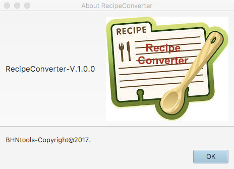
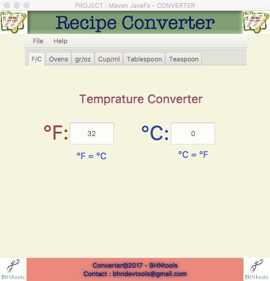

#RecipeConverter 1.0.0 
 Cooking Ingredients Conversion.
#=====================================

##Usage
=========

<code> java -jar jars/RecipeConverter-1.0-SNAPSHOT.jar </code>

##Building
===========
https://github.com/BHNtools/RecipeConverter

##Authors & Maintainer
========================
BEN HASSINE Najla, bhndevtools@gmail.com .

##License
==========
MIT License.